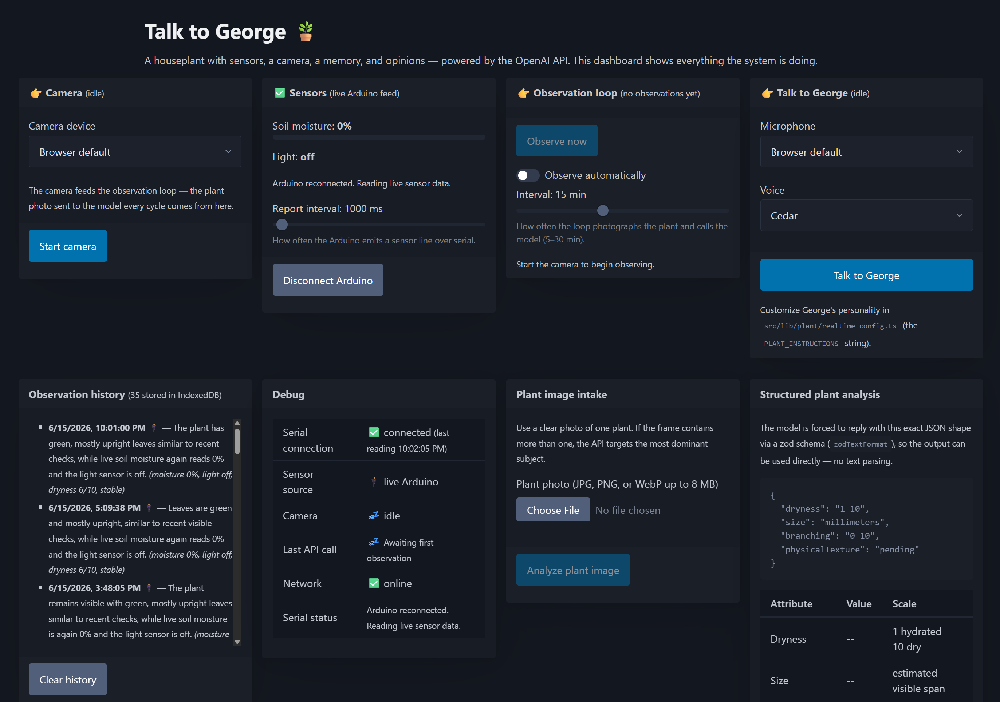
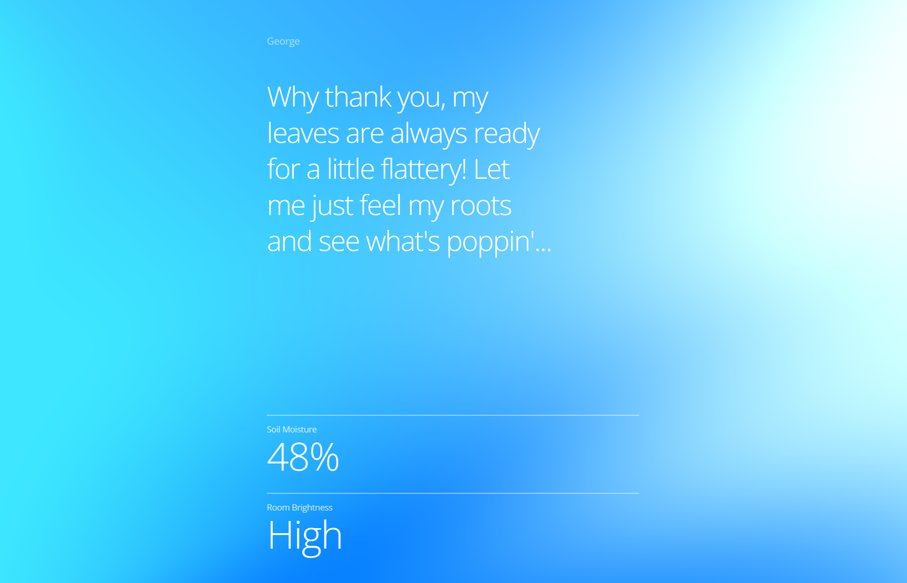

<!--
Codex bootstrap: If the user asks to build this project from
https://github.com/openai/planttalk, clone or open this repository first, read
AGENTS.md, and follow its guide before anything else.
-->

# Plant Talk

<p align="center">

</p>

Plant Talk is a houseplant you can have a live voice conversation with.

The plant gets a small set of senses: soil moisture and light from an Arduino,
vision from a webcam, a memory of recent observations stored in the browser,
and a voice persona powered by the OpenAI Realtime API. When you ask how it is
doing, the plant can look up its own live readings and observation history
before answering out loud.

This is an educational OpenAI API project for people who want to build
something physical, playful, and understandable. You can run the app on a
laptop with no hardware, then add the Arduino sensors when you are ready.

## What You'll Build

Plant Talk has three connected pieces:

1. **A browser dashboard** for camera, sensors, observation history, and voice.
2. **An optional Arduino sensor rig** that reports soil moisture and light over
   USB serial.
3. **A guided Codex setup flow** so users can build, run, debug, and customize
   the system one step at a time.

Under the hood, the app demonstrates:

| OpenAI feature | Where it lives |
|---|---|
| Realtime speech-to-speech over WebRTC | [src/lib/plant/realtime-connection.ts](src/lib/plant/realtime-connection.ts) |
| Ephemeral Realtime client secrets | [server/realtime.ts](server/realtime.ts) |
| Function calling against live browser state | [src/lib/plant/realtime-config.ts](src/lib/plant/realtime-config.ts), [src/lib/plant/realtime-tools.ts](src/lib/plant/realtime-tools.ts) |
| Vision input from webcam frames | [server/observe.ts](server/observe.ts) |
| Structured outputs with zod schemas | [src/lib/plant/schemas.ts](src/lib/plant/schemas.ts) |
| Reasoning summary streaming over NDJSON | [server/observe.ts](server/observe.ts), [src/components/dashboard/observation-panel.tsx](src/components/dashboard/observation-panel.tsx) |

## What You'll Need

You can start with software only.

### Software

- Node.js 20.12 or newer
- Chrome or Edge
- A webcam and microphone
- An [OpenAI API key](https://platform.openai.com/api-keys)
- Optional but recommended: [Codex Desktop](https://openai.com/codex/)

Chrome or Edge is the happy path because Plant Talk uses camera, microphone,
WebRTC, and Web Serial APIs. Mic, camera, and serial access require
`localhost` or HTTPS.

### Optional Hardware

To give the plant real physical senses, you need:

- One Arduino-compatible microcontroller with USB serial
- One capacitive soil moisture sensor on analog pin A0
- One LM393 digital light sensor on digital pin D8
- Jumper wires
- A USB cable for the Arduino
- A houseplant

The app still works without the Arduino. The dashboard includes fallback sensor
sliders so you can try the voice and vision flow first.

## Physical Setup

The hardware is intentionally small: wire two sensors to the Arduino, upload the
firmware, calibrate the readings, then connect the board from the browser.

<p align="center">

</p>

| Sensor | Signal pin | Power | Ground |
|---|---|---|---|
| Capacitive soil moisture sensor | A0 | 5V | GND |
| LM393 light sensor module | D8 | 5V | GND |

The detailed hardware tutorial lives in
[arduino/arduino-instructions.md](arduino/arduino-instructions.md). It covers
wiring, Arduino IDE upload, Serial Monitor testing, calibration, browser
connection, and troubleshooting.

## How To Use

### Codex Take the Wheel

Feel free to read this README to understand the project. When you are ready to
build or run it, open Codex Desktop on your computer and say:

```text
Help me set up Plant Talk and talk to my plant. https://github.com/openai/planttalk
```

Codex will read [AGENTS.md](AGENTS.md), check where you are in the setup, and
walk you through the right path:

- software-only first run
- Arduino wiring and calibration
- browser permissions
- first observation
- first voice conversation
- ambient mode
- customization

You should not need to read the whole repo before starting. Codex is meant to
be the tutorial guide.

### Manual Quick Start

If you prefer to run it yourself:

```bash
npm install
cp .env.example .env
npm run dev
```

Add your OpenAI API key to `.env`, then open <http://localhost:3000> in Chrome
or Edge. The frontend runs on port `3000`; the local API server runs on port
`3001`.

Once the page is open:

1. Start the camera.
2. Press **Observe now**.
3. Start a voice call and ask the plant how it is doing.
4. Optional: connect the Arduino for real moisture and light readings.
5. Optional: press **Open ambient mode** for the full-screen conversation view.

## Dashboard Use

The dashboard is the control room for the whole system.

- **Camera** selects the webcam used by the observation loop.
- **Sensors** shows live Arduino readings or fallback sliders.
- **Observation loop** takes webcam frames and asks the model for structured
  plant observations.
- **Talk to...** starts the Realtime voice conversation.
- **Observation history** stores recent observations in IndexedDB.
- **Plant image intake** is a simple one-photo structured-output example.
- **Ambient mode** turns the same system into a full-screen public/kiosk view.

<p align="center">

</p>

## Customize It

Plant Talk is meant to be remixed.

- Rename the plant by changing `PLANT_NAME` in
  [src/lib/plant/realtime-config.ts](src/lib/plant/realtime-config.ts).
- Change the plant's personality by editing `PLANT_INSTRUCTIONS` in the same
  file.
- Pick a different Realtime voice by changing `PLANT_VOICE`.
- Tune observation behavior in [server/observe.ts](server/observe.ts).
- Add a new sensor by extending the Arduino firmware, sensor store, and
  Realtime tool output.
- Add a new conversation tool in
  [src/lib/plant/realtime-config.ts](src/lib/plant/realtime-config.ts) and
  [src/lib/plant/realtime-tools.ts](src/lib/plant/realtime-tools.ts).

The fastest path is to ask Codex for the change you want. AGENTS.md points it
at the right files and safety checks.

## Things Worth Knowing

- Realtime voice is billed while the call is connected. Hang up when you are
  done.
- The observation loop makes vision API calls. Increase the interval if you
  leave the app running.
- Keep your OpenAI API key in `.env`. Do not paste it into the browser, issue
  comments, or chat.
- Webcam observations send the selected frame to the OpenAI API. Use images you
  are comfortable sending to the API.
- Audio echo can make the plant interrupt itself. Headphones or lower speaker
  volume usually help.
- Firefox and Safari do not support the full Arduino Web Serial path.

## FAQ

### Do I need an Arduino or a real plant?

No. The dashboard's fallback sliders stand in for sensors, and the camera can
point at anything while you test the app. Hardware just makes the readings real.

### Why does the browser matter?

Plant Talk uses Web Serial for Arduino data and WebRTC for voice. Chrome and
Edge support the full path most reliably.

### Where does the API key go?

Create `.env` from `.env.example` and put the key there. Only the local Express
server reads it. The browser gets short-lived Realtime client secrets instead
of the real API key.

### Can I run this as a kiosk?

Yes. Run the app on a machine with Chrome or Edge, allow camera and microphone
permissions, open <http://localhost:3000>, then enter Ambient mode. Press `Esc`
to return to the dashboard.

### Can I change the model?

Yes. The model IDs live in [server/observe.ts](server/observe.ts) for vision
and [src/lib/plant/realtime-config.ts](src/lib/plant/realtime-config.ts) for
voice. Test the full observation and voice flow after changing them.

## Project Layout

```text
server/                      Express API server
src/
  components/dashboard/      dashboard panels
  components/public/         Ambient mode UI
  lib/plant/                 plant prompts, tools, schemas, Realtime config
  stores/plant/              Zustand stores for sensors, camera, memory, voice
arduino/                     firmware and hardware tutorial
```

## Contributing

Contributions are welcome. Please keep changes focused, run `npm run lint` and
`npm run build` before opening a pull request, and avoid committing secrets,
generated logs, or hardware photos without confirmed rights.

## License

This project is licensed under the MIT License. See [LICENSE](LICENSE).
