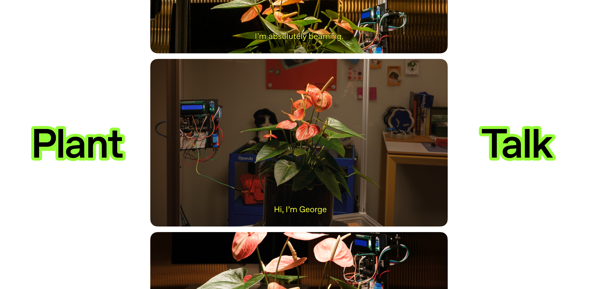
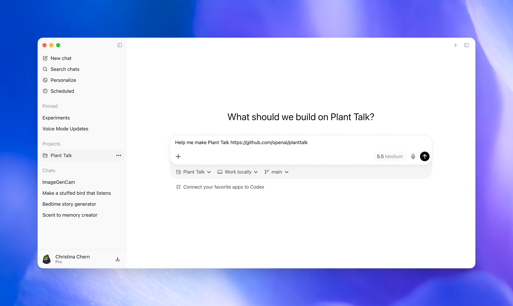
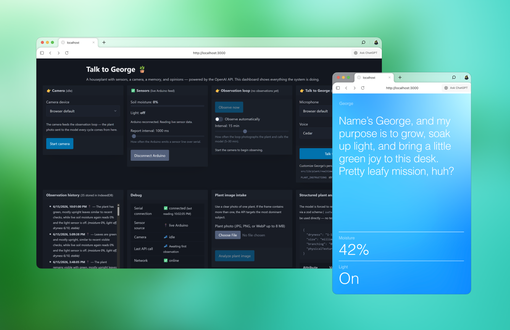
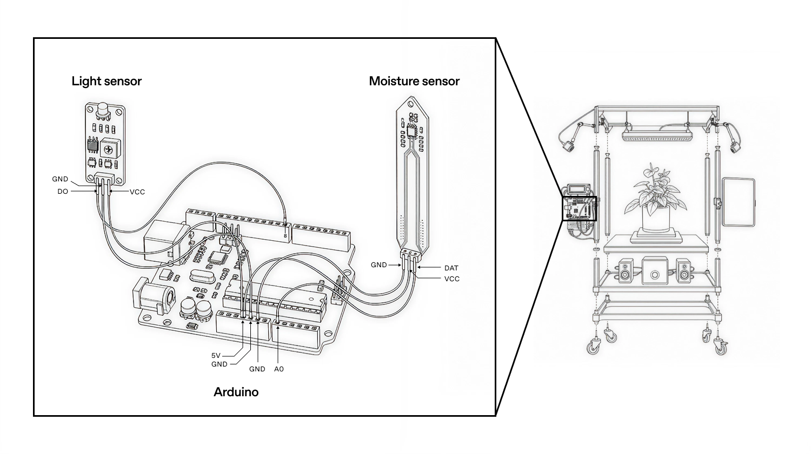

<!--
Codex bootstrap: If the user asks to build this project from
https://github.com/openai/planttalk, clone or open this repository first, read
AGENTS.md, and follow its guide before anything else.
-->



Plant Talk is a houseplant you can have a conversation with using ChatGPT.

Using just a computer (equipped with a webcam and a microphone) and the
OpenAI API, Plant Talk gives a plant a voice. Level up the project with an
Arduino or similar microcontroller and you'll be able to add more interesting
data like moisture and light too. Ask how it is doing and it can check its
recent observations, look at its current environment, and more.

You can get started with just a laptop, but the full version is designed for advanced builders - this is how we approached it, but this is a flexible build we encourage you to adjust based on your hardware and help from Codex.

## What You'll Need

You'll need one of each part below. You'll also need a computer with the Codex
Desktop app installed, a reliable Wi-Fi connection, and an OpenAI account. If
you use ChatGPT, you already have one.

### Parts

- A laptop or desktop computer
- Google Chrome or Edge
- Webcam
- Microphone and speakers (built-in ones are OK!)
- Houseplant of your choosing

For the sensing part of the system, you'll also need:

- Arduino-compatible microcontroller with USB cable
- Capacitive soil moisture sensor
- LM393 light sensor module
- Jumper wires
- Small prototyping breadboard

> **Note:** The system works without the Arduino. Without Arduino, Plant Talk
> uses just the camera to understand plant health and is much less accurate.



## How To Use

### Codex Take the Wheel



Feel free to read through this document to get familiar with the project. When
you're ready to build, before you start wiring anything, open
[Codex Desktop](https://openai.com/codex/) and type:

```text
Help me make Plant Talk https://github.com/openai/planttalk
```

Then complete the rest of this build directly in Codex. Codex will read this
repo, take you to the first setup step, and walk you through the build from
there.

## Using Plant Talk



Once everything is running, Plant Talk works like a small control room for your
plant. Open the dashboard, take an observation, and begin a voice conversation.
The system can take live sensor readings, summarize recent observations, and
talk about what the plant needs.

For most users, you'll want to leave the system in Ambient Mode when in use.

### Controls

- **Start camera:** selects the webcam Plant Talk uses for observations.
- **Observe now:** sends the current camera frame for a structured plant check.
- **Connect Arduino:** reads live soil moisture and light over USB serial.
- **Talk to plant:** starts the Realtime voice conversation.
- **Open ambient mode:** switches to a full-screen conversation view.

## Remix It

Once the basics are working, you've got a small programmable plant interface.
Make it useful, make it strange, make it fit your home, classroom, lab, or art
project.

Try asking Codex to add a watering reminder, support a different sensor, change
the ambient mode visuals, create a new plant persona, log long-term plant
health, or adapt the project for a classroom demo. The possibilities are
endless, and some starter built-in customization points include:

1. Name - change the name the voice assistant uses.
2. Personality - tune how the plant speaks and what it cares about.
3. Voice - swap the spoken voice used in conversation.
4. Observation - change what the camera analysis pays attention to.

## FAQ

### Do I need an Arduino?

No. You can run Plant Talk with only your computer, webcam, microphone, and
OpenAI API access. But, the Arduino sensors make the readings far more useful
(otherwise they're based only on what the webcam sees).

### Why Chrome or Edge?

Plant Talk uses some technology not supported by all internet browsers. Chrome
and Edge support it most reliably.

## License

This project is licensed under the Apache License, Version 2.0. See
[LICENSE](LICENSE) and [NOTICE](NOTICE).
