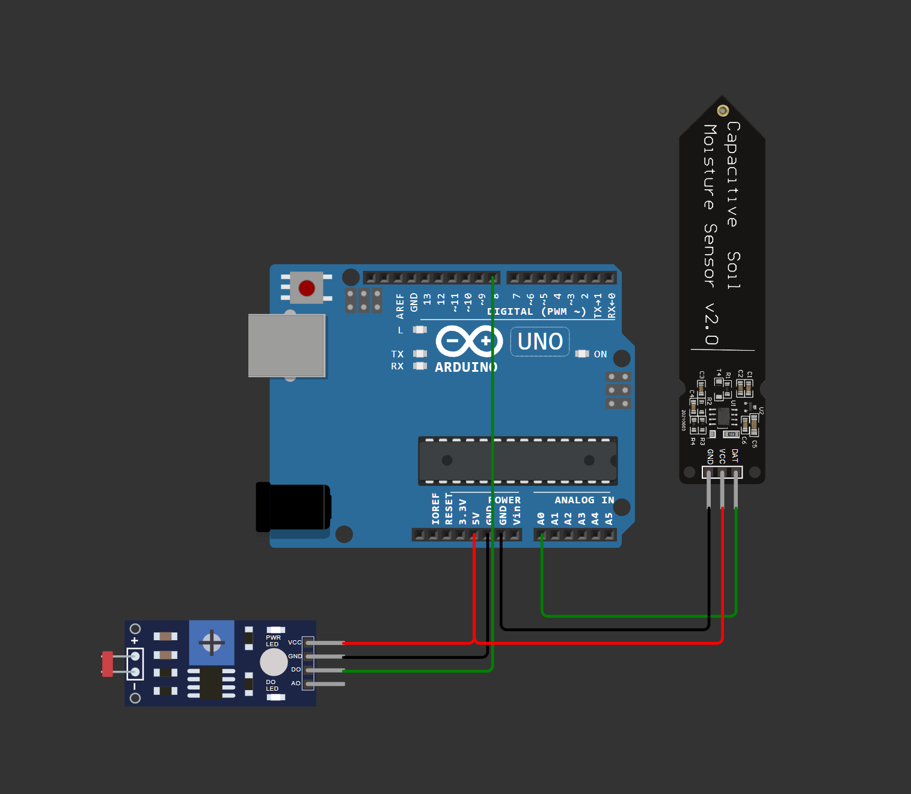
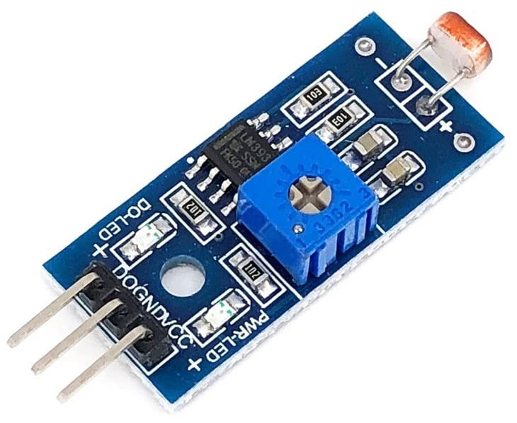
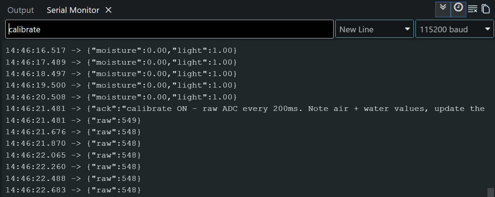

# Arduino wiring, calibration, and browser connection

This is the detailed hardware reference for Plant Talk. If you are using Codex,
you do not need to read it end to end first: Codex should walk you through one
physical step at a time, using this file as the source of truth.

## What is an Arduino?

An Arduino is a small computer, roughly credit-card sized, with no screen or
keyboard. Instead of running apps, it reads sensors and controls simple devices:
lights, motors, pumps, buttons, and the small bits of hardware that make a
physical project feel alive.

In Plant Talk, the Arduino is the plant's nervous system. It reads soil moisture
and light, then sends those readings to your computer over USB. The browser uses
that data in the dashboard and during the plant's voice conversation. Any
Arduino-compatible microcontroller should work as long as it can run an Arduino
sketch, connect over USB serial, and provide the pins used here.

If you do not have an Arduino yet, you can still run the app. The dashboard has
fallback sliders that stand in for the sensors, so you can try the conversation
first and add hardware later.

## What you will build

You will connect two sensors to the Arduino and have it report readings once per
second.



The two sensors are:

1. **Soil moisture sensor** — measures how wet the soil is, from 0% bone dry to
   100% fully wet.
2. **Light sensor** — reports whether the light level is above or below a
   threshold you set.

The Arduino reads both sensors, formats the result as JSON like
`{"moisture":45,"light":100}`, and sends it to the browser over USB.

## Bill of materials

You need four things. If you already have the Arduino, the sensors and wires
usually cost only a few dollars.

| Part | Example | Notes |
|------|---------|-------|
| **Arduino-compatible microcontroller** | Uno, Nano, Mega, or similar | Any compatible board with USB serial should work. Uno is the most common beginner option. |
| **Soil moisture sensor** | Capacitive Soil Moisture Sensor V2.0 | Usually comes with a 3-pin red/yellow/black cable. Look for the long probe end. |
| **Light sensor module** | LM393 digital light sensor | Small board with a light-detecting dome, blue adjustment screw, and green indicator LED. |
| **Jumper wires** | About 10 wires | The moisture sensor may include its own cable. The light sensor needs 3 loose jumper wires. |

Tip: search for the exact sensor part number or module name. These parts are
common, inexpensive, and sold by many electronics retailers.

---

# Step 1: Assemble the hardware

## About the sensors

**Soil moisture sensor**

- The long metal probe goes into the soil.
- It estimates moisture by measuring electrical resistance.
- Different sensors produce different raw numbers, which is why you will
  calibrate it later.
- The white line on the probe shaft marks the safe depth. Do not submerge it
  deeper than that.

**Light sensor**

- The clear dome on the front is the light-detecting element, also called an LDR.
- The blue plastic screw is the potentiometer. Turning it adjusts sensitivity.
- The green LED lights when the light level crosses the threshold you set.
- When it is dark, the sensor outputs HIGH. When it is lit, it outputs LOW. The
  firmware reverses that so the browser sees the more natural meaning.

This project uses a simple boolean light sensor because it is enough to tell
whether a grow light, or enough growing light, is on. Other light sensors can
report more detailed readings, such as lux, UV, or even color values. Those are
great extensions once the basic version is working.

## Wire the soil moisture sensor

Connect the three-pin cable from the soil moisture sensor to the Arduino using
this mapping. Most cables are color-coded.

| Sensor pin | -> | Arduino pin | Standard wire color |
|------------|----|-------------|---------------------|
| Signal, the probe reading | -> | **A0** (analog) | Yellow |
| VCC, power | -> | **5V** | Red |
| GND, ground | -> | **GND** | Black |

The cable from this sensor is usually pre-wired, so you can plug the loose ends
directly into the Arduino pins. If you use a different sensor brand, check its
datasheet; some inexpensive clones put the pins in a different order.


## Wire the light sensor

The light sensor has three pins: DO, VCC, and GND. Connect them with jumper
wires.

| Module pin | -> | Arduino pin | Notes |
|------------|----|-------------|-------|
| DO, digital output | -> | **D8** | This tells the Arduino whether the sensor sees light or darkness. |
| VCC, power | -> | **5V** | Same power rail as the moisture sensor. |
| GND, ground | -> | **GND** | Same ground rail as the moisture sensor. |

You will adjust the blue potentiometer after uploading the firmware, so you can
watch the sensor respond in real time.



---

# Step 2: Upload the firmware

The Arduino needs the plant sensor code before it can read anything. In Arduino
language, this is called uploading: the IDE compiles the code, sends it over USB,
and stores it on the board.

## Prerequisites

1. **Arduino IDE** — download it from <https://www.arduino.cc/en/software>.
2. **The firmware file** — [PlantSensors/PlantSensors.ino](PlantSensors/PlantSensors.ino).

## Upload steps

1. Plug in your Arduino with USB.
2. Open Arduino IDE.
3. Open the firmware file: **File -> Open -> `PlantSensors.ino`**.
4. Select your board: **Tools -> Board -> Arduino AVR Boards -> Arduino Uno**,
   or choose Nano/Mega if that is what you have.
5. Select the port: **Tools -> Port -> COM3**, or whichever port says Arduino
   next to it.
6. Click **Upload**, the arrow button in the top-left.

You should see "Compiling...", then "Uploading...", then "Done uploading". It
usually takes about 10 seconds.

Troubleshooting:

- **Board not found** — check that the Arduino is plugged in and that a port
  appears under **Tools -> Port**.
- **Permission denied** on macOS or Linux — the port may be locked. Unplug the
  Arduino and plug it back in.
- **Unknown file** — make sure you opened the `.ino` Arduino sketch, not a
  `.txt` file.

Once upload succeeds, the Arduino is ready to read the sensors.

---

# Step 3: Test with Serial Monitor

Before calibrating, make sure the Arduino is running and sending data. The
Serial Monitor is a window inside Arduino IDE that shows messages from the
board.

## Open Serial Monitor

1. Open **Tools -> Serial Monitor**.
2. In the bottom-right corner of the Serial Monitor, set the baud rate to
   **115200**.

The baud rate is how fast the Arduino and IDE talk to each other. Both sides
must use 115200, or the messages will look like scrambled characters.

## What you should see

If everything is working, JSON data appears once per second:

```json
{"moisture":45,"light":100}
{"moisture":46,"light":100}
{"moisture":45,"light":99}
```

The exact numbers will vary a little. That is normal.

- `moisture` is the moisture reading. Before calibration it may be a larger raw
  value such as 200-400.
- `light` is either 0 for dark or 100 for light.

If you see scrambled characters, the baud rate is wrong. Check the dropdown
again and set it to **115200**.

If you see nothing, upload the firmware again and confirm you selected the right
board and port.

If the numbers never change, one of the sensors may be wired incorrectly. Recheck
the pins from Step 1.

---

# Step 4: Calibrate the sensors

The soil moisture sensor reads electrical resistance. The exact values change
with sensor age, temperature, soil, and probe placement. Calibration teaches the
Arduino what "dry air" and "fully wet" look like for your sensor, so it can
convert raw readings into a 0-100% moisture level.

## Why calibration matters

Without calibration, 45% on one sensor might not mean the same thing as 45% on
another. Calibration makes the readings meaningful for your exact setup.

## Calibrate soil moisture



1. In Serial Monitor, type `calibrate` into the input box and press Enter.

   The Arduino switches to calibration mode and prints raw readings every 200ms.
   You will see output like:

   ```text
   Raw: 398 | Calibrating... (type 'calibrate' again to exit)
   ```

2. Hold the probe in open air without touching the metal prongs.

   Wait 3-5 seconds for the reading to settle. Note the raw number. This is your
   `AIR_VALUE`.

3. Submerge the probe in a cup of water up to the white line.

   Wait another 3-5 seconds. Note this raw number. This is your `WATER_VALUE`.
   Do not submerge past the white line; it can damage the sensor electronics.

4. Open `PlantSensors.ino` in Arduino IDE and find these lines:

   ```cpp
   #define AIR_VALUE 398    // Update this
   #define WATER_VALUE 56   // Update this
   ```

   Replace `398` with your air value and `56` with your water value.

5. Upload the firmware again with the updated values.

6. Type `calibrate` in Serial Monitor again to exit calibration mode.

You will know calibration worked when readings are high in air and low in water,
then after re-uploading, the JSON output shows about `{"moisture":0,...}` in air
and about `{"moisture":100,...}` when fully wet. The percentage should move
smoothly as you move the probe between dry and wet states.

## Set the light threshold

The light sensor uses the blue potentiometer to choose the brightness threshold.
You want it to switch cleanly between light and dark for your plant's location.

1. Keep Serial Monitor open and watch the JSON:

   ```json
   {"moisture":45,"light":100}
   {"moisture":45,"light":0}
   ```

2. Point the sensor at the light source above your plant. The `light` value
   should read `100`.

3. Slowly turn the blue potentiometer screw while watching both the Serial
   Monitor and the green LED on the sensor.

   Adjust it until the LED flips on and off when you cover and uncover the
   sensor with your hand. The JSON output should toggle between `0` and `100`.

You will know it is set well when the sensor reads `100` with the light on,
`0` in darkness, and the green LED changes at the moment you expect.

---

# Troubleshooting

| Symptom | Likely cause | What to try |
|---------|--------------|-------------|
| **Serial Monitor shows gibberish** | Baud rate mismatch | Set the Serial Monitor dropdown to **115200**. |
| **Serial Monitor shows nothing** | Firmware did not upload, or the wrong board/port is selected | Go back to Step 2, upload again, and check **Tools -> Board** and **Tools -> Port**. |
| **All readings stay the same** | Sensor wiring problem | Unplug the sensor and recheck the Step 1 wiring tables. |
| **Moisture readings are backwards** | Calibration values are swapped | Open `PlantSensors.ino` and make sure `AIR_VALUE` is higher than `WATER_VALUE`. If not, swap them. |
| **Moisture jumps wildly** | Normal jitter, loose wiring, or loose soil contact | Small variation is normal. If it swings by about 50 points, check that the probe and wires are firmly seated. |
| **Light sensor is always 0 or always 100** | Potentiometer is not set, or DO is wired wrong | Turn the blue screw slowly. If nothing changes, verify DO -> D8. |
| **Green LED never responds** | Potentiometer is at an extreme, or the sensor is faulty | Turn the screw all the way one direction, then slowly back. If it still does nothing, try another sensor. |
| **Arduino does not appear under Tools -> Port** | Board is unplugged or driver is missing | Unplug it, wait 2 seconds, and plug it back in. On Windows, check Device Manager -> Ports. |

---

# Step 5: Connect to the browser app

Once the sensors report sensible values, connect the Arduino to Plant Talk.

## Start the app

From the project root, run:

```bash
npm run dev
```

Then open <http://localhost:3000> in your browser.

## Connect the Arduino

1. Click **Connect Arduino** on the dashboard.
2. When the browser asks you to select a serial port, choose the one labeled
   Arduino or the COM port for your board.
3. Watch the dashboard update.

The sensors panel should show live moisture and light. The **Observe now**
button can run a camera analysis, and the voice panel can start a conversation
that uses the live readings.

If you have not run the software yet, go back to the main
[README.md](../README.md) or ask Codex to set up Plant Talk first. It is usually
easier to prove the dashboard, camera, and voice flow before debugging hardware.

## Browser compatibility

The app uses the Web Serial API, which is supported by Chromium-based browsers:

- **Chrome** 90+
- **Edge** 90+

Firefox and Safari do not support Web Serial. If **Connect Arduino** does not
work, switch to Chrome or Edge and try again.

---

## Serial protocol reference

Use this section if you want to inspect the firmware behavior or send commands
from Serial Monitor.

- **Baud rate:** 115200 bits per second
- **Output format:** one JSON object per line, once per second by default
- **Example:** `{"moisture":42,"light":1}` where the browser scales 0-1 values
  to 0-100%
- **Commands:**
  - `calibrate` — toggle calibration mode and print raw ADC readings
  - `interval <ms>` — change the output interval, for example `interval 500`
  - `read` — print one sensor reading immediately
  - `status` — print firmware version and current settings

---

## Next steps

You are done: the Arduino is feeding real sensor data to the plant.

- To customize the plant's personality, edit `src/lib/plant/realtime-config.ts`.
- To change the observation interval, use the debug panel in the dashboard.
- To understand the full architecture, read the main [README.md](../README.md).

Happy observing.
